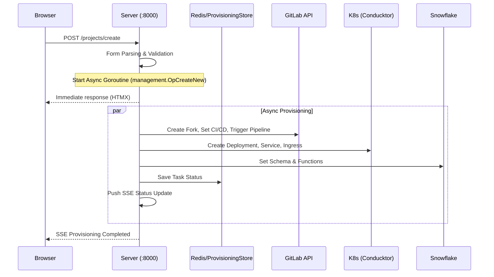
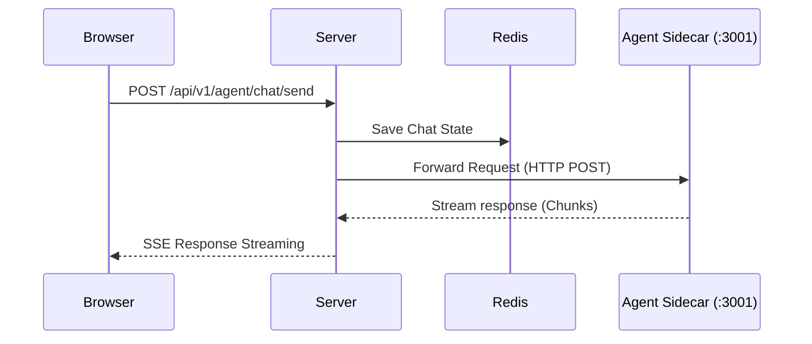

# 📊 Analytics-as-Code (aac_portal) Architecture

Analytics as a Code (AaC)는 원클릭 프로세스 스캐폴딩 플랫폼입니다. 여러 인프라에 걸쳐 분석 과정을 생성, 관리 및 실시간 시각화하는 것을 목표로 하며, 다양한 채팅 에이전트를 지원합니다.

---

## Content
1. [Overview](#1-overview)
2. [Tech Stack](#2-tech-stack)
3. [Directory Structure](#3-directory-structure)
4. [Core Package](#4-core-package)
5. [Call Flow](#5-call-flow)
6. [API Route List](#6-api-route-list)
7. [Middleware Chain](#7-middleware-chain)
8. [Background Worker](#8-background-worker)
9. [Auth Flow](#9-auth-flow)
10. [Function List](#10-function-list)
11. [Skill Reference](#11-skill-reference)
12. [Gitignore](#12-gitignore)
13. [Build and Deployment](#13-build-and-deployment)

---

## 1. Overview

| 항목 | 상세 내용 |
| :--- | :--- |
| **Language** | Go 1.24.1 |
| **Code Scale** | 93 Files, ~36k Lines |
| **Architecture** | Monolithic Go Backend + SSR (HTML/CSS/JS) Frontend |
| **Container** | Wolfi (Alpine-based) Linux Dockerfile |
| **Port** | 8000 (Internal) |
| **CI/CD** | GitLab CI |
| **Deployment** | Kubernetes (K8s) - DEV / STG / PRD |

---

## 2. Tech Stack

### 🚀 Backend
| Component | Library | Version | Usage |
| :--- | :--- | :--- | :--- |
| **HTTP Server** | `net/http` | Standard | Routing & Handlers |
| **Database** | `gosnowflake` | v1.15.0 | Snowflake SQL Driver |
| **Cache** | `go-redis/v9` | v9.14.0 | Redis Client |
| **K8s** | `k8s.io/client-go` | v0.34.2 | Kubernetes API Client |
| **Helm** | `helm.sh/helm/v3` | v3.19.4 | Helm Chart Management |
| **JWT** | `golang-jwt/v5` | v5.2.2 | Token Parsing & Validation |
| **Metrics** | `prometheus/client_golang` | v1.23.2 | Metrics Collection |
| **Logging** | `slog` + `tint` | Standard | Structured Color Logging |
| **Config** | `gopkg.in/ini.v1` | v1.67.0 | INI File Parsing |
| **Security** | `crypto/aes` | Standard | AES-256-GCM Encryption |
| **Highlight** | `chroma/v2` | v2.23.1 | SQL Syntax Highlighting |
| **UUID** | `google/uuid` | v1.6.0 | Identifier Generation |
| **Cron** | `robfig/cron/v3` | v3.0.1 | DQE Scheduler |
| **Cloud SDK** | `azure-sdk-for-go` | Multiple | Resource Management |

### 🎨 Frontend
| Tech | Description |
| :--- | :--- |
| **Go HTML Template** | Server-side Rendering (SSR) |
| **HTMX 2.0.4** | Declarative AJAX (hx-get, hx-post, hx-target) |
| **Vanilla JS** | Pure JavaScript for interactive logic |
| **ECharts 5** | Data Visualization Charts |
| **Chart.js 4.4.1** | Lightweight Chart Editor |
| **CodeMirror** | SQL Editor with ESM.sh CDN |
| **SweetAlert2** | Modern Dialogs & Modals |
| **SSE** | Server-Sent Events for Real-time Updates |
| **Custom CSS** | 14k+ lines (Branding, Dark Mode) |

---

## 3. Directory Structure

```text
aac-portal/
├── cmd/
│   └── main.go                 # Entry point (Bootstrap)
├── internal/
│   ├── aacportal/              # Core logic & Dependency Injection
│   ├── server/                 # HTTP Handlers & Middlewares (23k LOC)
│   ├── storage/                # DB (Snowflake) & Persistence Layer
│   ├── management/             # Project Provisioning & Metrics
│   ├── infra/                  # K8s & Azure ARM SDK Wrappers
│   ├── kb/                     # Knowledge Base & Semantic Engine
│   ├── chat/                   # Agent Chat Messaging Pipeline
│   ├── vcs/                    # GitLab API Wrapper
│   ├── iam/                    # Entra ID (MS Graph) Integration
│   ├── atlassian/              # JIRA & Confluence Integration
│   ├── crypto/                 # AES Security Utilities
│   └── filesystem/             # Embedded templates & Static assets
├── helm/                       # K8s Deployment Charts
├── oauth2-proxy/               # Authentication Proxy Config
├── grafana/                    # Monitoring Dashboards
└── docs/                       # Architecture Documentation
```

---

## 4. Core Package

### 4.1 `cmd/main.go` - Entry Point
프로그램의 시작점으로 로그 초기화, 설정 로딩, 그리고 메인 서비스 실행을 담당합니다.
1. `slog` + `tint` 로거 초기화
2. `aacportal.ini` 설정 파일 로드
3. `project_types.json` 템플릿 로드
4. `aacportal.New()` 호출 (의존성 주입 및 서비스 초기화)
5. `d.Run()` 실행 (HTTP 서버 시작)

### 4.2 `internal/aacportal` - App Orchestration
모든 서브시스템(Snowflake, Redis, K8s 등)을 초기화하고 `server.NewServer()`를 호출하여 서버를 구성합니다.

### 4.3 `internal/server` - HTTP Server
표준 라이브러리 `net/http`를 기반으로 한 강력한 라우팅 및 핸들러 시스템입니다.

```go
// Router Definition
router := http.NewServeMux()
router.HandleFunc("/path", handlerFunc)

// Handler Struct Pattern (Dependency Injection)
type Handler struct {
    Template      *template.Template
    SessionStore  *InMemorySessionStore
    Snowflake     *storage.SnowflakeStorage
    Cache         *Cache
    // ... 30+ Dependency Fields
}
```

### 4.4 `internal/storage` - Data Maintenance
Snowflake 및 로컬 스토리지 관리를 담당합니다.
* **Snowflake**: `database/sql` 패키지와 JWT 인증을 통한 연결 관리
* **Main Tables**: 사용자 설정, DQE 규칙, KB 항목, 에이전트 상태 등

### 4.5 `internal/kb` - Knowledge Base Engine
시맨틱 데이터 모델링을 통해 자연어를 SQL로 변환하고 Snowflake View를 생성하는 핵심 엔진입니다.

---

## 5. Call Flow

### 5.1 Project Provisioning Flow (Main)
새로운 분석 프로젝트가 생성되는 핵심 흐름입니다.



### 5.2 Agent Chat Flow


---

## 6. API Route List

### 🔑 Auth and Session
| Method | Path | Handler | Description |
| :--- | :--- | :--- | :--- |
| **GET** | `/health` | `HealthcheckHandler` | K8s health check (Public) |
| **GET** | `/api/v1/session/health` | `SessionHealthHandler` | Validate session status |
| **GET** | `/api/v1/session/see` | `SSEHandler` | Real-time status SSE streaming |
| **GET** | `/api/v1/session/keepalive` | `KeepAiveHandler` | Session keep-alive |
| **GET** | `/api/v1/auth/silent-refresh` | `SilentAuthRefresh` | Token silent refresh |
| **POST** | `/api/v1/auth/silent-callback` | `SilentAuthCallback` | Auth callback for refresh |
| **GET** | `/api/v1/snowflake/oauth2/callback`| `SnowflakeOauth2CallBack`| Snowflake OAuth2 callback |
| **GET** | `/api/v1/gitlab/oauth2/callback` | `GitLabOauth2CallBack` | GitLab OAuth2 callback |
| **GET** | `/api/v1/azure/oauth2/callback` | `AzureOauth2CallBack` | Azure OAuth2 callback |
| **GET** | `/api/v1/atlassian/oauth2/callback`| `AtlassianOauth2CallBack`| Atlassian OAuth2 callback |
| **GET** | `/api/v1/proxy/callback` | `ProxyCallback` | General proxy callback |

### 📂 Project Management
| Method | Path | Handler | Description |
| :--- | :--- | :--- | :--- |
| **GET/POST** | `/projects/create` | `HTMXProjectsCreate` | GET Form / POST Execution |
| **GET** | `/projects/create/onboard` | `HTMXProjectsCreateOnboard` | Project onboarding form |
| **GET** | `/projects/create/status` | `HTMXProjectsCreatesStatus` | Provisioning task status |
| **GET** | `/projects/manage` | `HTMXProjectsManage` | Main management dashboard |
| **GET** | `/projects/manage/data` | `HTMXProjectsManageData` | Project data assets |
| **GET** | `/projects/manage/detail` | `HTMXProjectsManageDetail` | Detailed project info |
| **GET** | `/projects/manage/environments` | `HTMXProjectsManageEnvironments`| K8s environment list |
| **GET** | `/projects/manage/branches` | `HTMXProjectsBranchList` | VCS branch list |
| **GET** | `/projects/manage/members` | `HTMXProjectsMemberSearch` | Member search & management |

### 🚀 App Service Management
| Method | Path | Handler | Description |
| :--- | :--- | :--- | :--- |
| **POST** | `/projects/manage/appservice/start` | `HTMXAppServiceStart` | Start K8s service |
| **POST** | `/projects/manage/appservice/stop` | `HTMXAppServiceStop` | Stop K8s service |
| **POST** | `/projects/manage/appservice/restart` | `HTMXAppServiceRestart` | Restart K8s service |
| **GET** | `/projects/manage/appservice/deployments`| `HTMXAppServiceDeployments`| List current deployments |
| **GET** | `/projects/manage/appservice/config` | `HTMXAppServiceConfig` | Service configuration |

### 🤖 Isolated Code Agent
| Method | Path | Handler | Description |
| :--- | :--- | :--- | :--- |
| **GET** | `/agent/sessions` | `HTMXAgentSessions` | Active agent sessions |
| **POST** | `/agent/create` | `HTMXAgentCreate` | Spawn new agent |
| **POST** | `/agent/delete` | `HTMXAgentDelete` | Terminate agent |
| **GET** | `/agent/chat` | `HTMXAgentChat` | Chat UI interface |
| **POST** | `/api/v1/agent/chat/send` | `AgentChatSend` | Send message to agent |
| **GET** | `/api/v1/agent/chat/history` | `AgentChatHistory` | Retrieve chat logs |
| **POST** | `/api/v1/agent/chat/clear` | `AgentChatClear` | Clear session history |
| **GET** | `/api/v1/agent/health` | `AgentHealthCheck` | Agent sidecar health |
| **GET** | `/api/v1/agent/workers` | `AgentListWorkers` | List active workers |
| **POST** | `/api/v1/agent/provision` | `AgentAPIProvisionProject`| Agent-led provisioning |

### 🎨 GenUI
| Method | Path | Handler | Description |
| :--- | :--- | :--- | :--- |
| **GET** | `/genui` | `HTMXGenUI` | GenUI main interface |
| **POST** | `/genui/generate` | `GenUIGenerate` | Request AI visualization |
| **GET** | `/genui/progress/{id}` | `GenUIProgress` | Generation status poll |
| **POST** | `/genui/cancel/{id}` | `GenUICancel` | Cancel generation |
| **GET** | `/genui/viz/{id}` | `genUIServeWidget` | Serve generated widget |
| **POST** | `/genui/viz/{id}` | `genUISaveToDashboard` | Save widget to dashboard |
| **GET** | `/genui/dashboards` | `GenUIDashboards` | Saved dashboards list |

### 🧠 Knowledge Base (KB)
| Method | Path | Handler | Description |
| :--- | :--- | :--- | :--- |
| **GET** | `/kb` | `HTMXBlist` | KB main list view |
| **GET** | `/kb/editor` | `HTMXBEditor` | Semantic model editor |
| **GET** | `/kb/state` | `HTMXBState` | Materialization state |
| **POST** | `/kb/materialize` | `HTMXKBMaterialize` | Create Snowflake views |
| **POST** | `/kb/publish` | `HTMXKBPublish` | Publish semantic model |
| **POST** | `/kb/layout` | `HTMXKBAutoLayout` | Auto-layout KB nodes |

### ⚖️ Data Quality Engine (DQE)
| Method | Path | Handler | Description |
| :--- | :--- | :--- | :--- |
| **GET** | `/dqe` | `HTMXDQEList` | DQE rules list |
| **GET** | `/dqe/editor` | `HTMXDQEDetail` | Rule editor interface |
| **POST** | `/dqe/validate` | `HTMXDQEValidate` | Validate SQL syntax |
| **POST** | `/dqe/execute` | `HTMXDQEExecute` | Manual rule execution |

### 🔌 Model Context Protocol (MCP)
| Method | Path | Handler | Description |
| :--- | :--- | :--- | :--- |
| **GET** | `/.well-known/oauth-protected-resource` | `MCPProtectedResourceMetadata` | OAuth resource metadata |
| **GET** | `/.well-known/oauth-authorization-server` | `MCPAuthorizationServerMetadata`| OAuth server metadata |
| **GET** | `/mcp/oauth/authorize` | `MCPAuthorize` | MCP OAuth authorization |
| **POST** | `/mcp/oauth/token` | `MCPToken` | OAuth token exchange |
| **POST** | `/mcp` | `MCPHandler` | MCP JSON-RPC handler |

### 🌐 API V2 (Bearer Token)
| Method | Path | Handler | Description |
| :--- | :--- | :--- | :--- |
| **GET** | `/api/v2/kb/list` | `APIKBList` | List KB assets |
| **GET** | `/api/v2/kb/describe` | `APIKBDescribe` | Describe KB schema |
| **POST** | `/api/v2/kb/save` | `APIKBSave` | Save KB semantic model |
| **POST** | `/api/v2/kb/query` | `APIKBQuery` | Execute semantic query |
| **POST** | `/api/v2/genui/generate` | `APIv2GenUIGenerate` | External GenUI request |
| **POST** | `/api/v2/genui/viz/{id}` | `APIv2GenUIVisualization` | Fetch visualization |

---

## 7. Middleware Chain
```txt
// go lang: middleware is a func wrapper chain for http.Hanlder
// each middleware return new hanlder after getting handler
// (ref: https://pkg.go.dev/net/http#handler)

requestLogger(logger)( // 1. 요청로깅
    setSessionCookie(sessionStore)( // 2. 세션 쿠키 설정/검증 
        setSessionEntraProfile(sessionStore,cache)(  // 3. 프로파일주입
            injectRequestLogger(sessionStore)( // 4. 요청별 컨텍스트 로커
                ensureUserInDatabase(sessionsStore, store)( // 5. 사용자 존재 확인
                    restorePersistedTokens()( // 6. Redis 에 토큰복원 영구 sso
                        autoRefreshTokens()( // 7. 만료 임박 토큰 자동 갱신
                            setCORSHeader()( // 8. CORS 헤더
                                router,  // 9. 라우터 (최종핸들러)
                            )
                        )
                    )
                )
            )
        )
    )
)
```
## 8. Background Worker
worker | cycle | role
session clear | 5 min | after expired , clean memory
token update (in-memory) | always | in-memory session OAuth token
token update (Redis) | always | Redis SSO token update
K8s cache | 5 min | All env k8s resource status sync 
GitLab cahce | per user | user Gitlab proect fork list update
Global cache | regular | service account has Gitlab fork cache warming
DQ scheduler | cron | DQ work auto run
Chat processor | event | agent message queue 

## 9. Auth Flow
### 9.1. 전체 인증 아키텍쳐
 - 브라우저  
 - OAuth2-Proxy (:4180) (Entra ID SSO, JWT, Header injection), X-Forwarded-Email Token. 
 - Portal (:8000) (Handle Session, Save Token , Update Token)
### 9.2. 지원 OAuth2 
 - Azure Entra ID (iframe silent refrehs)
 - Gitlab REpository / MR / pipeline  (auto token update)
 - Snowflake Database query token (JWT + OAuth)
 - Atlassian JIRA confluence (OAuth Token2)
### 9.3. SSO (perpetual SSO)
 - 1. 사용자 로그인
 - 2. Oauth token
 - 3. 사용자 재접속
 - 4. 백그라운드 : 만료 전 자동 갱신 
  
## 10. Function List
- Provisioning (Snowpark, Streamlit, Python/Node/DotNet, AI agent, CronJob, Airflow, ADF)
- Knowledge Base (semantic model and SQL auto creation)
- GenUI (Claude AI baed DVA)
- DQ engine (XML base data quality rule)
- Agent Chat (K8s secluded chat AI)
- MCP (Claude Code IDE portal)
- Workbook (Snowflake SQL workbook edit and run sync with Gitlab)
- Manager Dashboard (Cache, API key, system monitor)
- Multi env (DEV/STG/PRD)
- Grafana dashbaord. (Prometheus metric real time monitor)

## 11. Skill Reference

### 11.1. Go core pattern

```h
// HTTP server and routing 
router :=http.NewServeMux()
router.HandleFunc ("/path", func (w http.ResponseWriter, r *http.Request){
    // w; ResponseWriter
    // r; Request
})
// server start
server :=&http.Server{
    Addr: ":8000",
    Handler: middlewqaqreChain(router),
}
server.ListenAndServe()

// Middle ware pattern
func myMiddleware (next http.Handler) http.Handler {
    return http.HanlderFunc (func (w http.ResponseWriter, r * http.Request){
        // preprocess auth and logging
        next.ServeHTTP (w,r) // next handler call
        // after work and response logging
    })
}

// Goroutine - async for provisioning and background worker
go func() {
    result, err := management.OpCreateNewProject(...)
    if err !=nil {
        logger.Error("provisioning failed", "error" ,err)
        return
    }
    // SSE end close
    sseHub.NotifyProvisioningJobUpdate(sessionID, result)
}()

// Struct method and interface 
type Handlers struct {
    SessionStore *InMemory SessionsStore
    Snowflake *storage.SnowflakeStorage
    Cache *Cache
}

func (h *Hanlders) HTMXHome (w http.ResponseWriter, r *http.Request){
    session, _ :=h.SessionStore.GetSessionFromRequestCookie(r)
    h.Template.ExecutteTemplate (w, "landing", data)
}

// Go Embeded. ref: https://pkg.go.dev/embed 
// 배포시 별도 파일 서버 없이 단일 바이너리로 정적 서빙가능. 패키지로 빌드 시 파일을 바이너리에 포함
var templateFS embed.FS
var staticFS embed.FS

// database/sql pacakge
db, err :=sql.Open("snowflake", dsn)
rows, er := db.QueryContext (ctx, "SELECT * FROM table WHERE id=?", id)
defer rows.Close()
for rows.Next() {
    var col1, col2, string
    rows.Scan(&col1 &col2)
}

// Server-Sent Event (SSE)
// 서버 에서 클라이언트로 실시간 단방향 스트리밍 제공. 
// ref: https://developer.mozilla.org/en-US/docs/Web/API/Server-Sent_events
// go 에서 http.Flusher interface 사용
func ()
```
### 11.2. FrontEnd Pattern
```h

// HTMX delarable AJAX 
<!-- HTMX 는 HTML 속성으로 AJAX 요청을 선언적으로 정의함 -->
<!-- ref: https://htmx.org/docs/ -->
<!-- 
   hx-get: GET 요청을 보냄.
   hx-target: 응답 HTML 을 삽입할 대상 요소 
   hx-swap: HTML 삽입 방식 (innerHTML , outerHTML 등)
   hx-trigger: 이벤트 트리거 (click, Load, every 등)
-->

<button hx-get="/projects/manage/data" 
        hx-target="#projct-list"
        hx-swap="innerHTML">
        프로젝트 새로고침
</button>
<!-- form 제출 -->
<form hx-post="/projects/create"
      hx-target="#status"
      hx-swap="innerHTML">
      <input name="project-name" required>
      <button type="submit">생성</button>
</form>

// Go Tempalte syntax 
<!-- Go html/template 패키지로 서버사이드 렌더링 -->
<!-- ref: https://pkg.go.dev/html/template -->
<!-- 
    {{ .FieldName }} : data field output
    {{ if .Condition }} : conditional render
    {{ range .Items }} : repeat loop render
    {{ template "name" . }} : sub tempalte included 
-->
{{ block "index" . }}
<html>
    <body>
        <h1>{{ .Version }}</h>
        {{ if .GitLabAccessTokenExpired }}
            <span class ="badge-expired">GitLab 만료됨</span>
            {{ end }}
            {{ range .Projects }}
                <div>{{ .Name }} - {{ .Status }}</div>
            {{ end }}
    </body>
</html>
{{ end }}

// Fetch API (browser to Server) 
// Vanilla JS Fetch API is in use to call server API
// Ref: https://developer.mzilla.org/en-US/docs/Web/API/Fetch_API
// Axios 나 JQuery 없이 표준 Fetch 만 사용
// crendentials: 'same-origin' 으로 세션 쿠키를 자동포햐ㅏㅁ.
fetch('/kb/state?id=' + encodeURIComponent(kbId), {
    credentials: 'same-origin'

})
.then(r=>r.json()).tehn(data=> {
    // KB 상태 업데이트
    applyKBState(data.data, data.updated_at);
});
// POST 요청
fetch('/genui/viz/sae', {
    method: 'POST'
    body: formData
}).then(r=>r.json()).then(result=>console.log(result));
```

### 11.3. Infra & DevOps Pattern
```h
// Docker file (multistatge biuld)
# Wolfi 기반 최소 이미지 사용
# ref: https://docs.docker.com/biuld/building/multi-stage/
# tini: PID 1 init process 로 좀비 프로세스 방지
# nonroot: 보안을 위한 비루트 사용자 실행
FROM wolfi-base:latest
RUN apk ADD --no-cache tini
USER nonroot
ENTRYPOINT ["tini", "--", "/app/app"]

// GitLab CICD 
# .gitlab-ci.yml: build -> pkg -> test -> deployment ref: https://docs.gitlab.com/ee/ci/
# stages: 실행 순서 정의 
# ruleas; 조건부 실행 (브랜치, 이벤트 등)
# artifacts: 빌드 결과물 전달
stages:
 - build # Go binary compile
 - package # Docker image build
 - test # container security scan
 - deploy # Helm in use for K8s delploy (DEV/STG/PRD) 

// Helm values (Jinja2 template)
# K8s deploy setting
# ref: https://helm.sh/docs/chart_tempalte_guide/
# values.yaml.j2 는 CI/CD 에서 Jinja2 로 렌더링 후 Helm 에 전달
# 환경변수 (K8S_NS, APP_PORT 등) 주입됨.
replicaCount: 1
image:
    repository: registry.gitlab.com/project/team/devops/
    tag: {{ CI_COMMIT_SHA }}
```


## 12. Gitignore
*(TBD: 제외 파일 목록)*

## 13. Build and Deployment
*(TBD: CI/CD 파이프라인 및 Wolfi 이미지 빌드)*
